

  

  <h1 align="center">FlowLY</h1>

<strong>AI 图片工作流解析器</strong>

  读取并解析 AI 图片中的工作流、参数与附加元数据。 
  支持单图查看、多图差异对比、本地收藏、ComfyUI 节点检索与摘要卡导出。

  <a href="https://flow.ete.moe">在线体验</a> ·
  <a href="https://github.com/eastmoe">GitHub</a>

---

## 简介

**FlowLY** 是一个轻量级、纯前端的 AI 图片信息查看工具。  
你可以直接拖入图片，在浏览器本地读取其中的元数据、工作流和插件信息，无需后端、无需数据库。

目前支持：

- **Stable Diffusion WebUI**
- **ComfyUI**
- **NovelAI**
- **Midjourney（MJ）**

支持读取的图片格式包括：

- **PNG**
- **JPG / JPEG**
- **WEBP**

## 入口

- 主入口：<https://flow.ete.moe>

## 特性

- 本地解析图片元数据，不上传图片
- 统一摘要卡，快速查看模型、提示词、分辨率、步数等关键信息
- 多图参数对比，支持高亮差异内容
- ComfyUI 工作流可视化与节点搜索
- SD WebUI 插件 / 附加元数据归类展示
- 本地收藏、搜索、筛选、导入、导出
- 摘要卡导出，适合分享
- 多语言界面：简中 / 繁中 / English / 日本語 / 한국어
- 多主题与多模式切换

## 截图

### 单图解析摘要卡

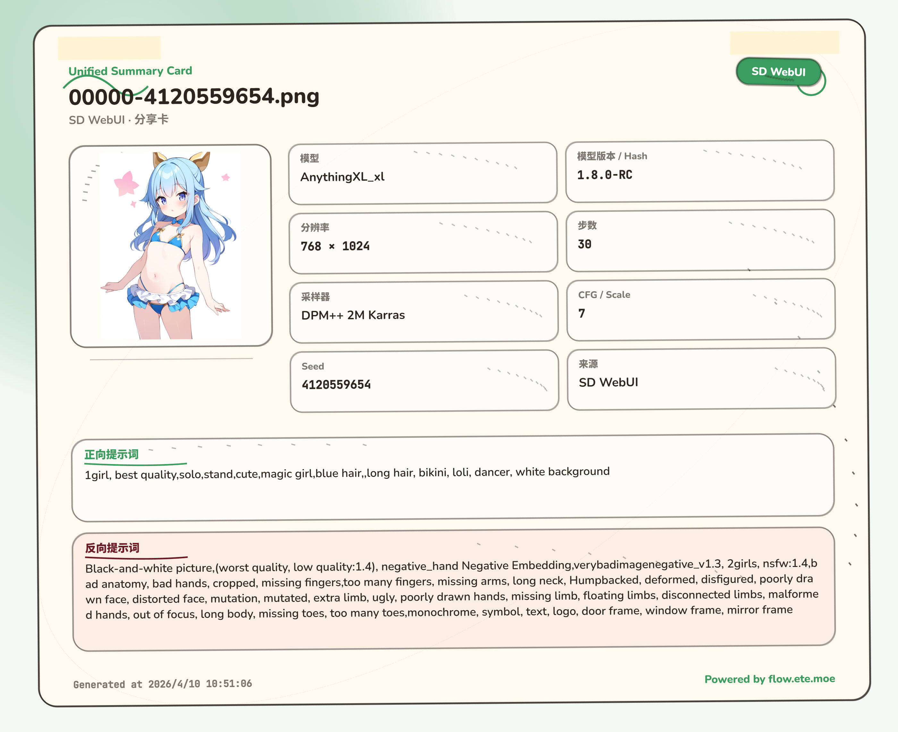

### ComfyUI 工作流可视化与节点检索

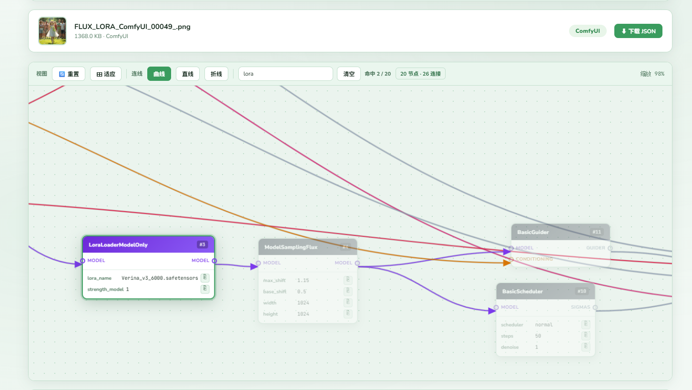

### 多图参数对比与字符级差异高亮

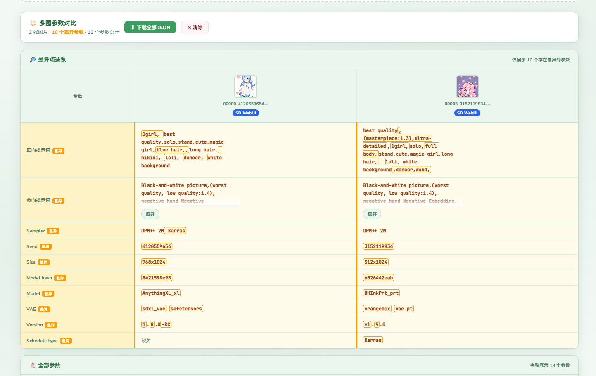

### 本地收藏、筛选与存储占用

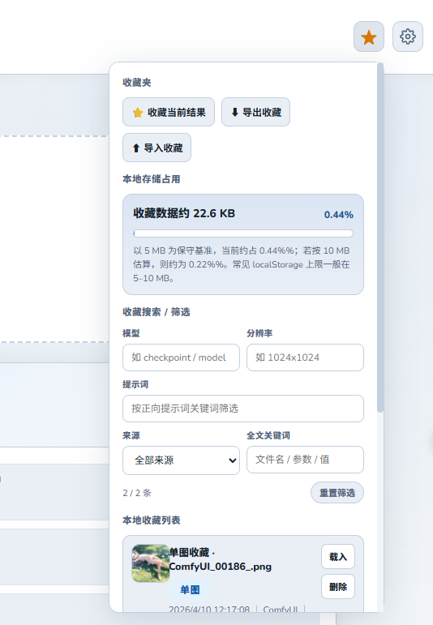

### 多语言界面

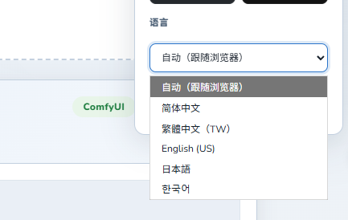

### 主题与外观

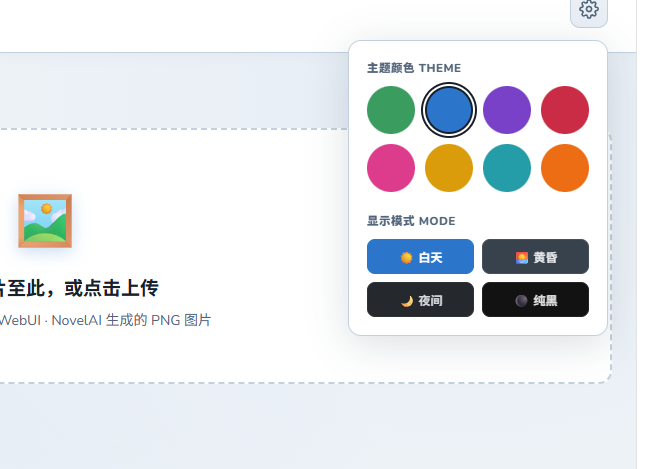

<table>
  <tr>
    <td>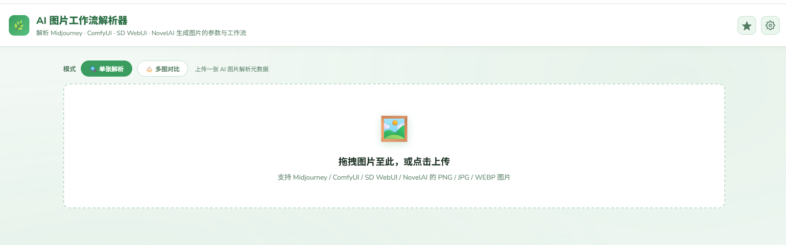</td>
    <td>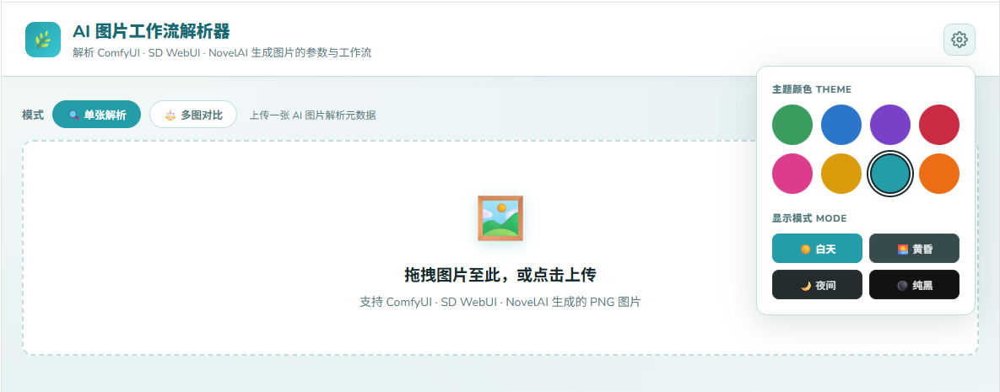</td>
  </tr>
  <tr>
    <td>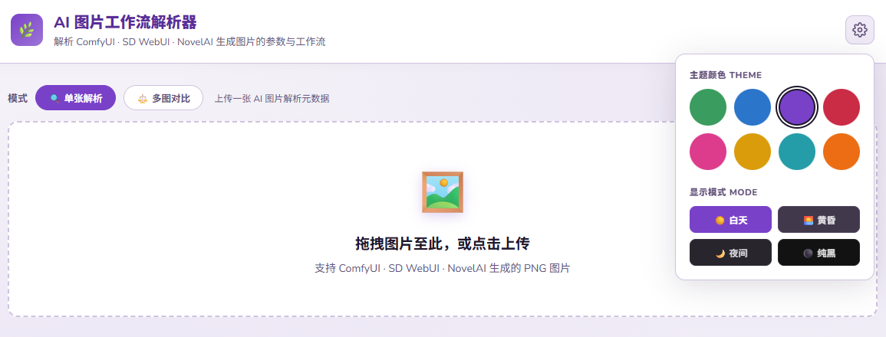</td>
    <td>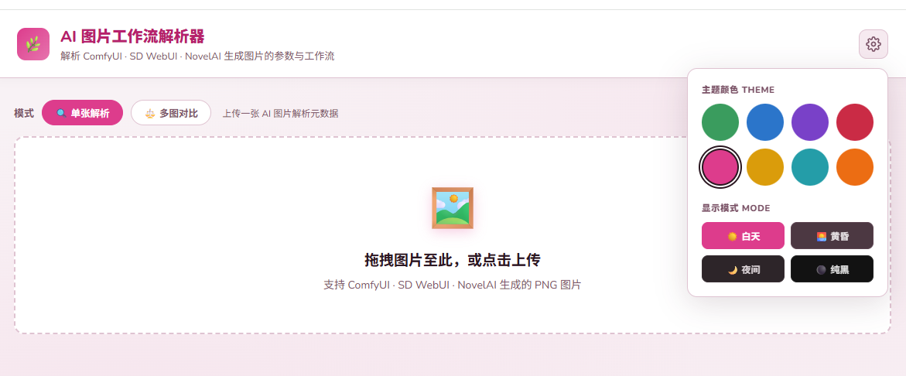</td>
  </tr>
  <tr>
    <td>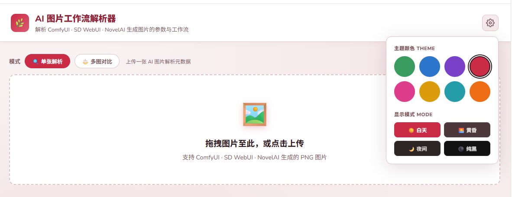</td>
    <td>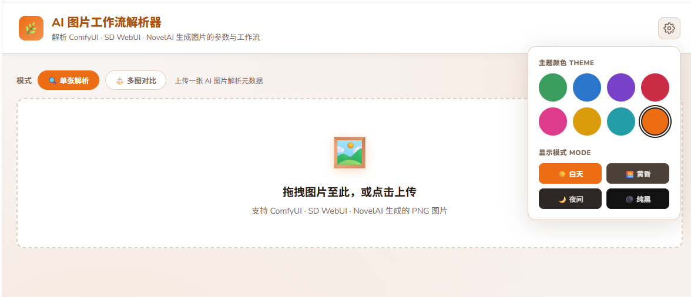</td>
  </tr>
  <tr>
    <td>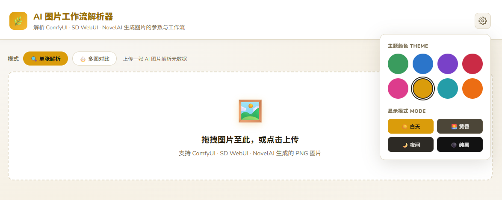</td>
    <td>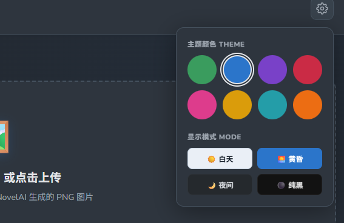</td>
  </tr>
  <tr>
    <td></td>
    <td>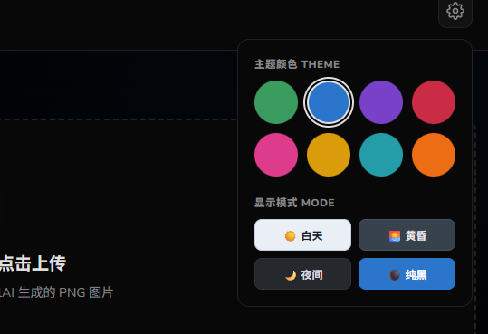</td>
  </tr>
</table>

## 使用方式

1. 打开 <https://flow.ete.moe>
2. 拖入或选择一张或多张图片
3. 查看解析结果、摘要卡、工作流与差异对比
4. 按需复制、导出 JSON、收藏到本地或导出摘要卡

## 适用场景

- 回看 AI 图片生成参数
- 分析不同图片之间的参数差异
- 检索 ComfyUI 工作流节点与参数
- 整理和归档常用图片工作流
- 分享简洁的生成摘要卡

## 技术特点

- 单文件、纯前端、轻量部署
- 浏览器本地处理，默认不上传图片
- 适合部署在静态站点平台，例如 Vercel

## 免责声明

- 不同平台或转发链路可能会清除图片中的元数据
- 不保证所有来源图片都一定包含完整工作流或参数
- 本地收藏依赖浏览器存储，不同设备之间默认不同步

## License

